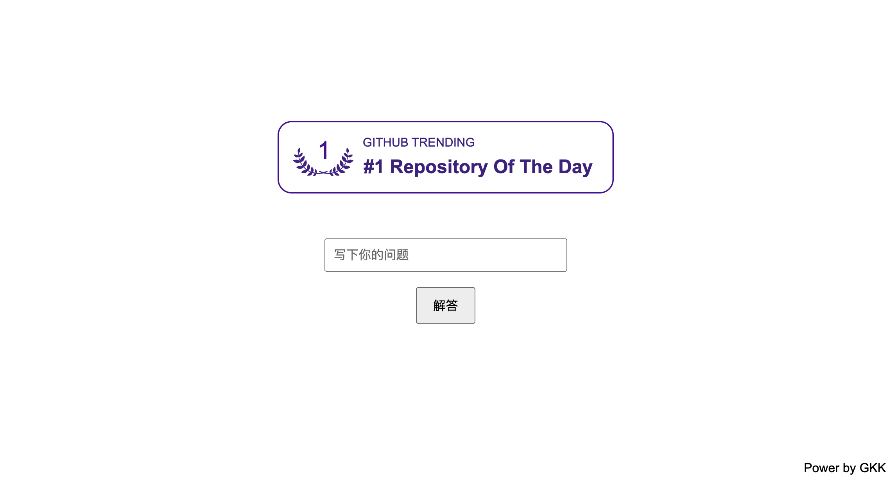

# QAvits
answer  question  with your voice using rag or just explanation
depend on [GPT_SoVITS](https://github.com/RVC-Boss/GPT-SoVITS)
 

# Usage
- `cp GPT-SoVITS/GPT_SoVITS/* to GPT_SoVITS/` 
- `vi conf.py` set your trained data path
- `vi query.py` set your rag data
- `python api.py`
- m1: open brower, input a question and click "解答"，wait few second later
- m2: `python client.py` & input a question